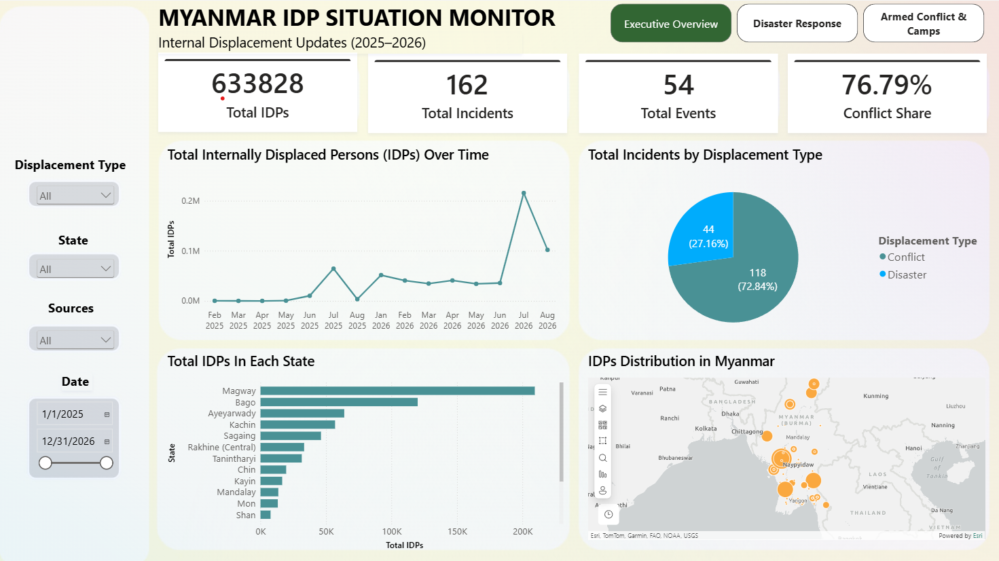

# Myanmar Crisis Displacement & Humanitarian Operations Monitor

## Tech Stack
Power BI, DAX, Power Query (M-code)

## Overview
This project delivers an end-to-end operational decision-support dashboard tracking conflict- and disaster-induced internal displacements across Myanmar (2025–2026). Designed under UN/OCHA and humanitarian operational reporting standards, the system monitors **633,828 total IDP displacements** across **162 incidents** and **54 macro-events** to support targeted resource allocation, contingency site planning, and emergency aid delivery.

---

### 📊 Dashboard Preview

### 🔗 Interactive Dashboard
[View on Power BI Service](<YOUR_POWER_BI_SERVICE_LINK_HERE>)

---

## 📋 Operational Problem & Objectives

### Problem
Field coordinators and humanitarian relief clusters face severe operational friction due to structural data imbalances: conflict displacements follow an unpredictable $1:N$ event-to-incident pattern clustering in destination safe havens, whereas natural disasters follow a $1:1$ seasonal impact pattern in origin hazard zones. Without an integrated monitoring system, emergency responses risk misallocating finite camp resources and misjudging acute influxes.

### Objective
Provide operational visibility into displacement triggers, temporal seasonality, and geographical hotspots across all administrative states/regions to enable agile camp coordination and humanitarian logistics planning.

---

## 🎯 Key Analytical Questions

- What is the structural split between armed conflict and natural disaster displacements?
- How do natural disasters fluctuate seasonally, and which disaster categories generate the largest displacement surges?
- Where are the primary destination hotspots and IDP camp concentrations located for armed conflict?
- What is the operational baseline (median IDPs per incident vs. median duration) required to size modular relief response packages?

---

## 📊 Dataset & Assumptions

### Dataset Information
- **Source:** [Humanitarian Data Exchange (HDX) - Myanmar IDMC Internal Displacement Updates (IDU)](https://data.humdata.org/dataset/mmr-idmc-idu-events)
- **Contributor:** Internal Displacement Monitoring Centre (IDMC) / OCHA HDX
- **Time Period:** 2025 – 2026
- **Geographic Scope:** Myanmar (National & Sub-national Level 1 / States & Regions)

### Data Assumptions & Normalization
- Only records designated with `role = 'Recommended figure'` are utilized for official aggregate metrics.
- Conflict displacement figures reflect **Destination** locations (IDP camps, host communities, and reception centers).
- Natural disaster displacement figures reflect **Origin** locations (hazard impact zones).
- Due to extreme right-skewed distributions, **Median** metrics are prioritized over arithmetic means for duration and incident scale to prevent outlier distortion.

---

## 🔧 Key Steps Taken

- **Data Transformation & Cleaning:** 
  - **Column Pruning & Dimension Reduction:** Removed redundant metadata, duplicated date attributes, and non-analytical fields to slim down table width and optimize VertiPaq memory footprint.
  - **Administrative Normalization:** Extracted and standardized the **`State`** column from raw `locations_name` strings via Power Query (M-code) to normalize sub-national administrative entities across all entries.
  - **Triangulation Filtering:** Filtered out unverified secondary reports and non-recommended records (keeping only `role = 'Recommended figure'`) to eliminate triangulation duplicates and prevent double-counting IDP figures.
  - **Composite Surrogate Key Creation:** Engineered a unique composite primary key **`event_location_id`** by concatenating `event_id`, `latitude`, `longitude`, and `locations_name`, establishing a granular unique identifier across spatial and multi-incident crisis logs.
- **KPI & Core Metrics Development:** 
  - Engineered fundamental business metrics via DAX: `Total Displacements (IDPs)`, `Total Incidents`, `Total Events`, and `Conflict Share (%)`.
  - Built robust statistical variants including `Median Duration (Days)`, `Median IDPs / Incident`, and continuous cumulative S-curve measures.
- **UI/UX & Deployment:** 
  - Designed a high-density, accessible 3-page operational framework ($4\text{ Cards} + 4\text{ Visuals}$ grid per page) utilizing clean monochromatic themes.
  - Deployed directly to Power BI Service for cloud-side query caching and low-latency field access.

---

## 💡 Key Insights

- **Conflict-Dominated Crisis:** Armed conflict is the overwhelming driver of displacement, accounting for **76.79%** of all IDPs (486,700 people across 118 incidents), while natural disasters represent **23.21%** (147,128 people across 44 incidents).
- **The July 2026 Conflict Epicenter:** Monthly displacement surged to an extreme peak of **215,636 IDPs in July 2026** (up from ~35,700 in June 2026), driven primarily by acute conflict escalation in **Magway Region**, which hosts **207,900 conflict IDPs** (~42.7% of all conflict displacements).
- **Disaster Seasonality & Profile:** Natural disasters exhibit strict seasonal clustering between **June and August** (monsoon season). **Floods** represent **50.0%** of all disaster events (21 events), followed by **Tornadoes (23.8%)** and **Storms (16.7%)**. The single largest disaster event recorded was the Ayeyarwady Region flood (63,300 IDPs).
- **Asymmetric Operational Dynamics:**
  - *Disasters:* Fast-moving shocks with a **Median Duration of 1.00 Day** and **Median IDPs/Incident of 104**, requiring rapid, short-term evacuations.
  - *Conflicts:* Protracted displacements with a **Median Duration of 8.00 Days** and **Median IDPs/Incident of 1,400**, requiring sustained camp management and long-term shelter logistics.

---

## 📈 Operational Implications

- **Logistics Bottlenecks in Magway & Bago:** With Magway (209,354 total IDPs) and Bago (119,979 total IDPs) absorbing over 50% of the entire country's displaced population, emergency supply chains face extreme saturation risks if aid corridors are disrupted.
- **Divergent Response Protocols:** Humanitarian agencies cannot use a single response model: disaster response demands agile, prepositioned rapid-evacuation kits before June, while conflict response requires establishing scalable, semi-permanent IDP camp structures.

---

## 🚀 Recommendations

- **Pre-position Regional Hubs in Central Myanmar:** Prioritize forward-operating supply caches (WASH kits, emergency shelters, high-energy food rations) along the Magway–Bago–Sagaing humanitarian axis to buffer against sudden conflict influxes.
- **Seasonal Flood Contingency Trigger:** Automate early-warning resource deployments by late May ahead of the July–August monsoon peak, focusing primarily on low-lying delta regions (Ayeyarwady) and flood-prone corridors (Kayin, Kachin).
- **Scale Modular Shelter Packages to 1,400-Pax Baseline:** Calibrate standard field deployment units around the **1,400-IDP median threshold** for conflict response rather than national averages, ensuring local camps avoid immediate overcrowding upon new incident arrivals.

---

## 📝 Project Structure

Project 11 - Myanmar Crisis Displacement & Humanitarian Operations Monitor
├── dashboard/
│   └── Myanmar Incidents.pbix
├── dataset/
│   └── mmr_idmc_idu_events.csv
├── images/
│   ├── armed_conflict_and_camps.png
│   ├── disaster_response.png
│   └── executive_overview.png
└── README.md

---

**Last Updated:** September 2026